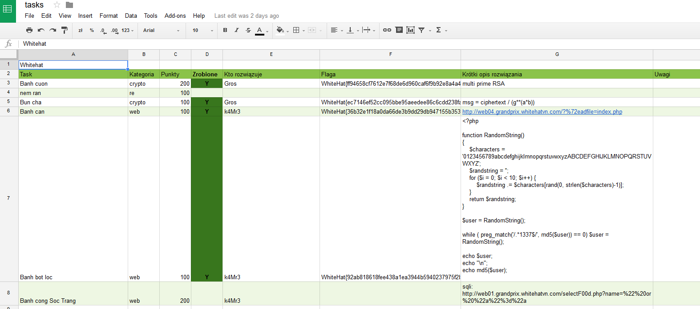

# CTF summary generator

The `generate_summary` script generates CTF summary based on google spreadsheet that contains information about who solved which CTF tasks. 

We use it in JHTC in order to send emails with CTF results/summary along with some "What we learned" info.

It has been written for Python 3. However it might work with Python 2.

## What does it do?

Pure words won't describe everything as fast as examples, so assume we have such spreadsheet:



And here we generate the summary:

```bash
$ python summary_generator.py 1aXcW2gEQIZHtjnN2EJMG73Z8Z6Do9VBqfxVKlWAnez2
Zdobyte punkty - 500:
- Gros: 300
    crypto - Banh cuon: 200
    crypto - Bun cha: 100
- k4Mr3: 200
    web - Banh can: 100
    web - Banh bot loc: 100
```

The `1aXcW2gEQIZHtjnN2EJMG73Z8Z6Do9VBqfxVKlWAnez2` is a spreadsheet key, which can be found in link to your spreadsheet (e.g. https://docs.google.com/spreadsheets/d/1aXcW2gEQIZHtjnN2EJMG73Z8Z6Do9VBqfxVKlWAnez2/edit#gid=0).

### Authentication

This of course requires some authentication. In order to make it working, you must create a "service account" within google spreadsheets api. All of this is already described in [gspread documentation](http://gspread.readthedocs.io/en/latest/oauth2.html).

After having the .json service key file, just put it in `./ccredentials/googlesheet_key.json`.

The last thing you have to do is to make the google spreadsheet service account be able to read particular spreadsheets. In the json key file, there is a `client_email`. Just share your spreadsheets to this e-mail address and job's done.

### The requirements for spreadsheet
* the header row must be a second row ([summary_generator.py#L42 - `head=2` argument](https://github.com/JustHitTheCore/ctf_summary_generator/blob/master/summary_generator.py#L42))
* it knows the data based on header names, which can be changed in [summary_generator.py#L27-L31](https://github.com/JustHitTheCore/ctf_summary_generator/blob/master/summary_generator.py#L27-L31)

## Requirements

The only requirements are `gspread` and `pandas` modules. In order to install them, you can use pip Python packages manager and our `requirements.txt` file:

```
pip install -r requirements.txt
```

To launch the script, see `How does it work?`.

## Want to help, have a problem or an idea

Just create an issue or/and help us with coding and make a Pull Request!

## Authors

The script has been made by disconnect3d from Just Hit The Core CTF team.

